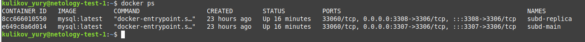
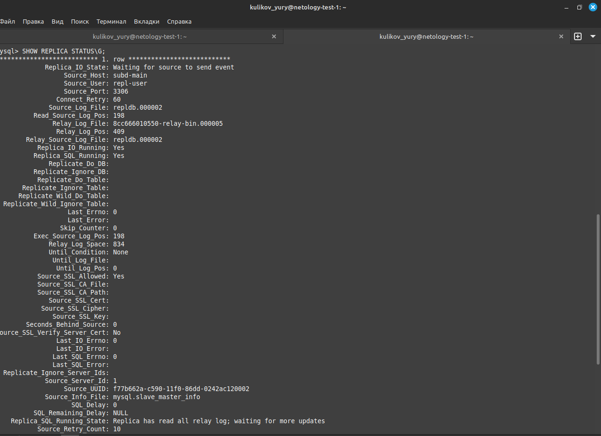
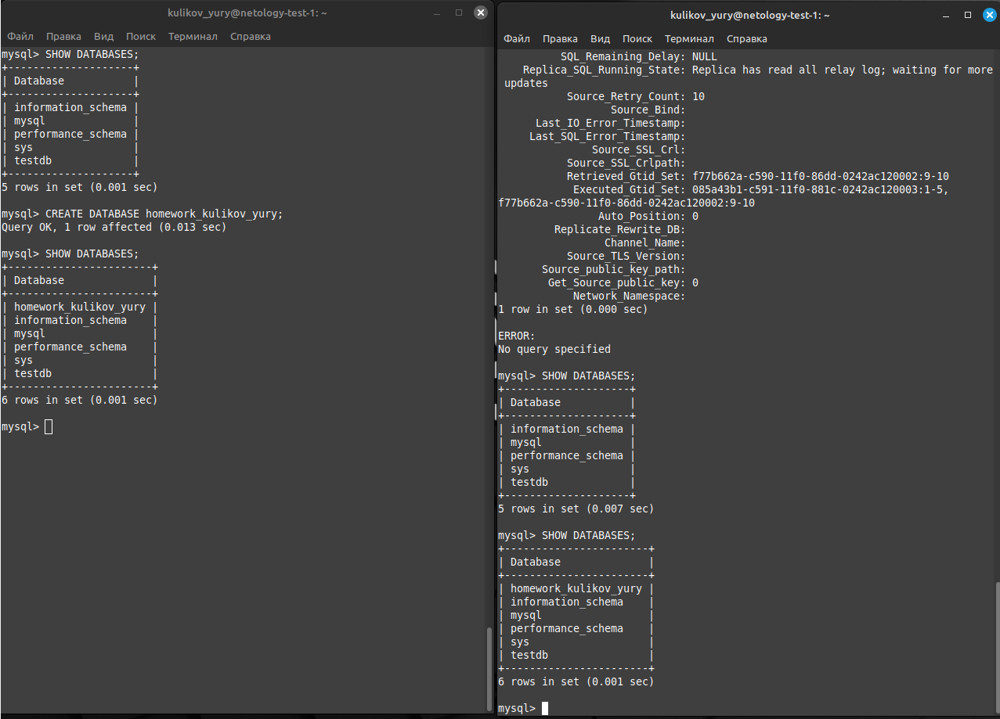
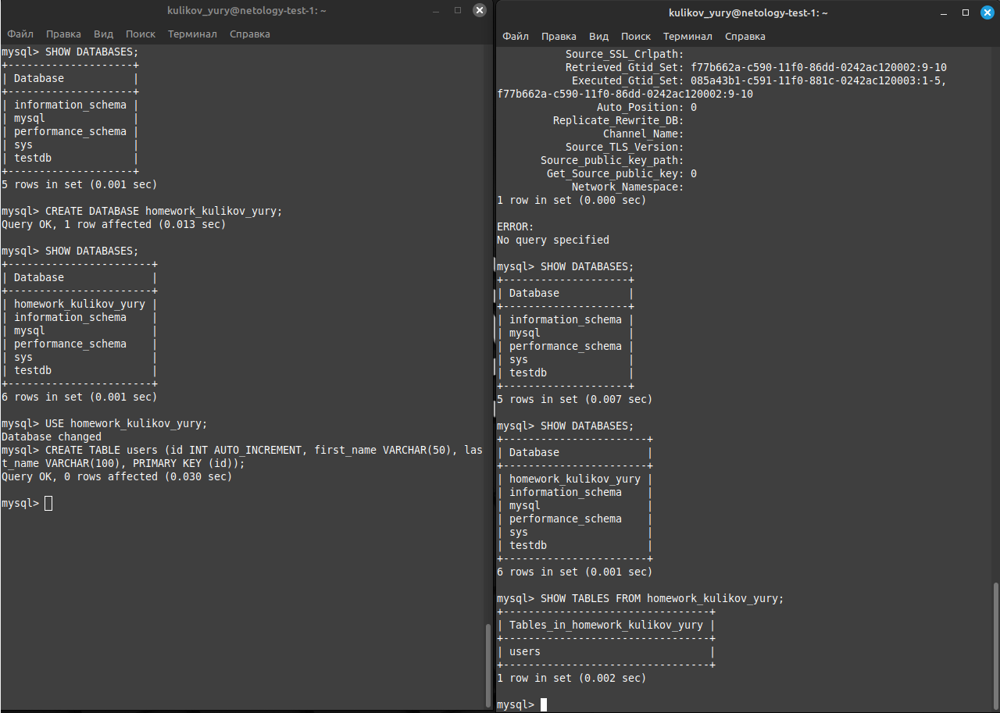

# Домашнее задание к занятию "`Репликация и масштабирование. Часть 1`" - `Куликов Юрий`


### Задание 1

На лекции рассматривались режимы репликации master-slave, master-master, опишите их различия.

Ответить в свободной форме.

---

### Решение 1

Master-slave, в данной схеме репликации:
* master - база данных в которую должны записываться данные.
* slave  - база данных, в которую реплицируются данные из master. Используется для чтения.
Данная схема репликации БД применяется чаще всего, и наиболее безопасна для целостности данных. Операции create, insert, update, alter вносятся только в master, в тоже время БД slave правильно запускать в режиме read only. Что гарантирует, что данные не будут внесены вручную (или запросами из программы). Однако, при авторизации под root всё же возможна запись в slave, что скорее всего приведёт к сбою и остановке репликации до удаления некорректных данных.
Так же преимуществом работы БД с данной схемой репликации является скорость работы БД. Так как данные вносятся на сервере в master, а читаются из множества серверов slave. Что балансирует нагрузку. Учитывая, что запросы на чтение, как правило сильно превалируют над операциями записи. 
И повышается отказоустойчивость. При падении одного из slave серверов, оставшиеся серверы поделят между собой нагрузку. Кроме того, при падении master сервера, его можно заменить slave сервером. Но будет небольшой временной лаг.

Master-master, более редкая схема репликации. Работает медленее чем master-slave, так как в данном случае во все master данные как пишутся, так и читаются. Имеет высокие риски сбоя репликации, в связи с возможностью внесения данных в любой master сервер. Но имеет небольшое преимущество перед master-slave в случае падения одного из master серверов. Временного лага по переключению на другой master сервер не будет.

---

### Задание 2

Выполните конфигурацию master-slave репликации, примером можно пользоваться из лекции.

Приложите скриншоты конфигурации, выполнения работы: состояния и режимы работы серверов.

---

Правим файлы конфигурации /etc/my.cnf на обоих серверах. Для сервера, на который будем реплицировать данные, добавляем запрет на внесение и изменение данных в конфиг файл read_only=1.



На master сервере (контейнер subd-main) создаём пользователя с правами на репликацию:
```
CREATE USER 'repl-user'@'%';
GRANT REPLICATION SLAVE ON *.* TO 'repl-user'@'%';
FLUSH PRIVILEGES;
```
На slave сервере (контейнер sudb-replica) запускаем репликацию:

```
CHANGE REPLICATION SOURCE TO 
SOURCE_HOST = 'subd-main', 
SOURCE_USER = 'repl-user';
```

Проверяем статус репликации:

```
SHOW REPLICA STATUS\G;
```




Создаём тестовую БД, и таблицу. Проверяем реплицировались ли данные:





---
